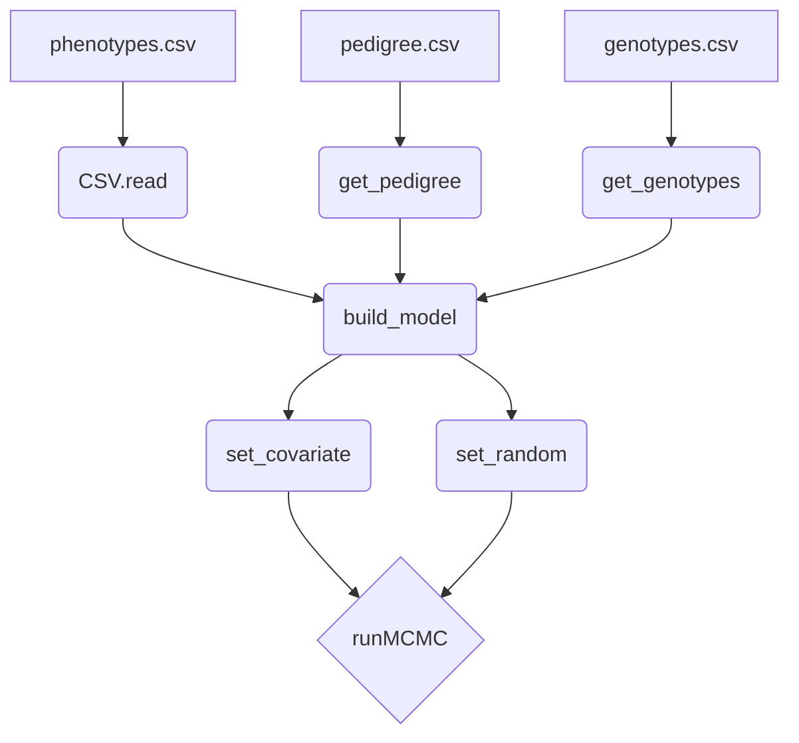

# NNMM.jl

[](https://github.com/reworkhow/NNMM.jl/actions/workflows/CI.yml)
[](https://reworkhow.github.io/NNMM.jl/latest)


NNMM.jl is an open-source software tool written in Julia for Bayesian multiple regression methods applied to genomic prediction and genome-wide association studies, with support for Neural Network Mixed Models (NNMM).

* **Homepage**: [QTL.rocks](https://QTL.rocks)
* **Discussion group**: [available here](https://groups.io/g/qtlrocks)
* **Documentation**: [available here](http://reworkhow.github.io/NNMM.jl/latest/)
* **Examples**: [available here](https://github.com/reworkhow/NNMM.jl/wiki)
* **Authors**: [Hao Cheng](https://qtl.rocks), [Tianjing Zhao](https://animalscience.unl.edu/faculty-staff/tianjing-zhao), [Rohan Fernando](http://www.ans.iastate.edu/people/rohan-fernando), [Dorian Garrick](http://www.massey.ac.nz/massey/expertise/profile.cfm?stref=600130)

### Installation

```julia
# Install from GitHub (development version)
using Pkg
Pkg.add(url="https://github.com/reworkhow/NNMM.jl")

# Or install the latest master branch
Pkg.add(PackageSpec(name="NNMM", rev="master"))
```

### Requirements

- Julia 1.9 or later
- See `Project.toml` for package dependencies

### Structure of NNMM



### Quick Start

```julia
using NNMM, CSV, DataFrames

# Load data
phenotypes = CSV.read("phenotypes.csv", DataFrame)
pedigree = get_pedigree("pedigree.csv", separator=",", header=true)
genotypes = get_genotypes("genotypes.csv", 1.0, header=true, separator=',')

# Build model
model_equation = "y1 = intercept + age + sex + genotypes"
model = build_model(model_equation, 1.0)

# Set effects
set_covariate(model, "age")
set_random(model, "sex", 1.0)

# Run MCMC
output = runMCMC(model, phenotypes, chain_length=10000, burnin=1000)
```

### Help

1. Show this README file in REPL or notebook using `?NNMM`
2. For help on a specific function, type `?` followed by its name, e.g., `?runMCMC`
3. Run `Pkg.free("NNMM")` to go back to the official registered version after using development version

### Features [examples available here](https://github.com/reworkhow/NNMM.jl/wiki)

* Single Trait Analysis
* Multiple Trait Analysis
* Repeated Measures
* Single Step Analysis
* Categorical Trait Analysis
* Censored Trait Analysis
* Joint Analysis of Continuous, Categorical, and Censored Traits
* Multi-class Bayesian Analysis
* **Neural Networks (NN-MM)**
* Cross Validation
* Genome Wide Association Study
* Integrating Phenotypic Causal Networks in GWAS
* Single trait and multiple trait GBLUP
* Quality Control of Genotypes

### Citation

If you use NNMM.jl in your research, please cite:

> Cheng, H., Fernando, R., & Garrick, D. (2018). JWAS: Julia implementation of whole-genome analysis software. Proceedings of the World Congress on Genetics Applied to Livestock Production, 11, 859.
