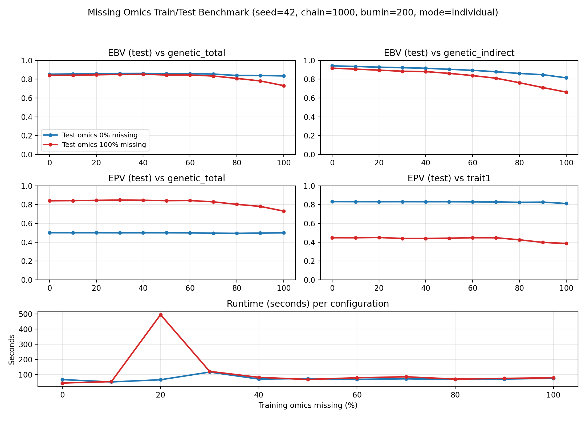

# Missing Omics Benchmark (Train vs Test) — Report

Date: 2026-01-04

## Goal

Design and run a *train/test* missing-omics benchmark for NNMM where:

- **Training** omics missingness is swept from **0% → 100%**.
- **Testing** omics missingness is either **0%** (all observed) or **100%** (all missing).
- **Testing individuals always have genotypes** (EBV is output for all genotyped IDs).

This matches the requested design and isolates the impact of missing intermediate-layer (omics) information in training vs test.

## Benchmark script

- Script: `benchmarks/benchmark_missing_omics_train_test.jl`
- Output CSV: `benchmarks/missing_omics_train_test_results.csv`
- Sanity-run log: `benchmarks/benchmark_missing_omics_train_test_sanity.log`

### Key design details

- Dataset: `simulated_omics_data` (3534 individuals, 1000 SNPs → 927 after QC, 10 omics).
- Split: random by `--seed`, with `--test-frac` fraction assigned to test.
- Phenotypes:
  - Training individuals keep `trait1` observed.
  - Test individuals have `trait1 = missing` (so they do not contribute to 2→3 likelihood).
- Omics missingness:
  - Training missingness uses `--missing-mode`:
    - `individual`: choose a fraction of *training individuals* and set **all** 10 omics missing for them.
    - `cell`: per-omics-column missingness in training (mostly useful for small missing rates).
  - Testing missingness is applied as 0% or 100% (whole-omics missing for test individuals).
- Model configuration (same as other parity benchmarks):
  - 1→2: BayesC, `estimatePi=true`
  - 2→3: BayesC, activation `linear`
- Metrics:
  - **EBV accuracy on test individuals**: `cor(EBV, genetic_total/direct/indirect)`
  - **EPV accuracy on test individuals**: `cor(EPV, genetic_total/direct/indirect)` and `cor(EPV, trait1)` using `EPV_Output_NonLinear`

### Why EPV(test) requires a new output

`EPV_NonLinear` is written only for **phenotyped IDs** (the 2→3 equation’s `obsID`). In this benchmark, test individuals have `trait1 = missing`, so they are excluded from that ID set and cannot appear in `EPV_NonLinear`. To evaluate EPV on test, NNMM now also writes `EPV_Output_NonLinear`, which is computed for all `output_ID` individuals (including test).

## Important NNMM algorithm fix (required for this benchmark)

This benchmark requires **some individuals** to have:

- `trait1` missing (test), AND possibly
- omics missing (test=100%, and/or train missingness)

Previously, NNMM’s latent-omics update path could fail in this situation because the HMC/MH step uses the **phenotype likelihood term** and assumes the corresponding residual vector for 2→3 exists.

### Fix applied

1. In `src/nnmm/mcmc_bayesian.jl`, the latent-omics update now splits incomplete-omics individuals into:
   - **incomplete + phenotype observed** → sample with HMC/MH (uses 2→3 likelihood term)
   - **incomplete + phenotype missing** → sample from the **1→2 conditional Normal** only

2. In `src/nnmm/check.jl`, initialization no longer errors for individuals with **no omics and no phenotype**; those missing omics cells are initialized to `0.0` so MCMC can proceed and update them from the 1→2 model.

This makes the benchmark (and any real setting with “genotypes-only test individuals”) run reliably.

## What has been run so far

### Sanity run

I ran a **small sanity check** to confirm correctness of the train/test masking + missingness logic:

```bash
export JULIA_DEPOT_PATH="$PWD/.julia_depot:/Users/haocheng/.julia"
julia --project=. benchmarks/benchmark_missing_omics_train_test.jl \
  --chain-length=30 --burnin=10 \
  --train-missing-grid=0 --test-missing-pcts=0,1 \
  --test-frac=0.2
```

Results (from `benchmarks/benchmark_missing_omics_train_test_sanity.log`):

| Train missing | Test missing | cor(EBV, total) | cor(EBV, direct) | cor(EBV, indirect) | time (s) |
|---:|---:|---:|---:|---:|---:|
| 0% | 0% | 0.7726 | 0.0169 | 0.8512 | 26.0 |
| 0% | 100% | 0.7458 | 0.0401 | 0.8096 | 3.2 |

Notes:

- These are **not stable accuracy numbers** (very short chain; intended only to validate plumbing).
- The first configuration often pays more JIT compile cost, so do not compare the two timing rows literally.

### Full grid run (completed)

I ran the full requested grid (11 train levels × 2 test levels = 22 runs) and recorded both EBV and EPV:

```bash
export JULIA_DEPOT_PATH="$PWD/.julia_depot:/Users/haocheng/.julia"
julia --project=. benchmarks/benchmark_missing_omics_train_test.jl \
  --seed=42 --chain-length=1000 --burnin=200 \
  --test-frac=0.2 \
  --missing-mode=individual \
  --train-missing-grid=0:0.1:1 --test-missing-pcts=0,1 | \
  tee benchmarks/benchmark_missing_omics_train_test_run_20260105.log
```

Artifacts:

- Full run log: `benchmarks/benchmark_missing_omics_train_test_run_20260105.log`
- Results CSV: `benchmarks/missing_omics_train_test_results.csv`

Summary table (EBV evaluated on **test** IDs; EPV evaluated on **test** IDs):

Notes:

- The CSV contains the full set of correlations (including direct/indirect for both EBV and EPV); the table below shows a compact subset.

| Train missing | Test missing | EBV(test,total) | EBV(test,indir) | EPV(test,total) | EPV(test,trait) | Time (s) |
| --- | --- | --- | --- | --- | --- | --- |
| 0% | 0% | 0.8526 | 0.9412 | 0.5009 | 0.8311 | 67.0 |
| 0% | 100% | 0.8416 | 0.9170 | 0.8406 | 0.4474 | 44.3 |
| 10% | 0% | 0.8554 | 0.9351 | 0.5005 | 0.8307 | 51.6 |
| 10% | 100% | 0.8418 | 0.9064 | 0.8422 | 0.4472 | 53.6 |
| 20% | 0% | 0.8566 | 0.9272 | 0.5004 | 0.8304 | 65.9 |
| 20% | 100% | 0.8463 | 0.8956 | 0.8454 | 0.4498 | 494.8 |
| 30% | 0% | 0.8611 | 0.9220 | 0.4999 | 0.8306 | 116.5 |
| 30% | 100% | 0.8495 | 0.8842 | 0.8483 | 0.4398 | 121.0 |
| 40% | 0% | 0.8615 | 0.9159 | 0.5001 | 0.8304 | 70.5 |
| 40% | 100% | 0.8512 | 0.8803 | 0.8463 | 0.4399 | 81.8 |
| 50% | 0% | 0.8585 | 0.9049 | 0.5002 | 0.8304 | 73.6 |
| 50% | 100% | 0.8447 | 0.8615 | 0.8417 | 0.4427 | 67.7 |
| 60% | 0% | 0.8581 | 0.8937 | 0.4992 | 0.8296 | 68.6 |
| 60% | 100% | 0.8440 | 0.8378 | 0.8432 | 0.4475 | 79.0 |
| 70% | 0% | 0.8541 | 0.8791 | 0.4962 | 0.8282 | 72.0 |
| 70% | 100% | 0.8333 | 0.8099 | 0.8292 | 0.4471 | 85.3 |
| 80% | 0% | 0.8391 | 0.8605 | 0.4943 | 0.8247 | 67.8 |
| 80% | 100% | 0.8078 | 0.7621 | 0.8028 | 0.4255 | 70.3 |
| 90% | 0% | 0.8387 | 0.8475 | 0.4973 | 0.8261 | 70.7 |
| 90% | 100% | 0.7809 | 0.7104 | 0.7807 | 0.3977 | 74.7 |
| 100% | 0% | 0.8345 | 0.8138 | 0.4996 | 0.8117 | 75.2 |
| 100% | 100% | 0.7311 | 0.6621 | 0.7309 | 0.3866 | 79.3 |

Plot (generated from the CSV):



To regenerate:

```bash
python benchmarks/plot_missing_omics_train_test.py
```

## How to run (again)

Default full grid is 11 train levels (0,10,…,100%) × 2 test levels (0%,100%) = **22 runs**:

```bash
export JULIA_DEPOT_PATH="$PWD/.julia_depot:/Users/haocheng/.julia"
julia --project=. benchmarks/benchmark_missing_omics_train_test.jl \
  --seed=42 --chain-length=1000 --burnin=200 \
  --test-frac=0.2 \
  --missing-mode=individual \
  --train-missing-grid=0:0.1:1 --test-missing-pcts=0,1
```

Outputs:

- Console summary table (per config).
- `benchmarks/missing_omics_train_test_results.csv` (all configs).

## Optional follow-ups

- Repeat the full grid across multiple seeds and summarize mean±sd for each configuration.
- Add a `--missing-mode=cell` run with smaller rates (e.g., 0–10%) to study sparse cell-wise missingness separately from individual-wise missingness.
